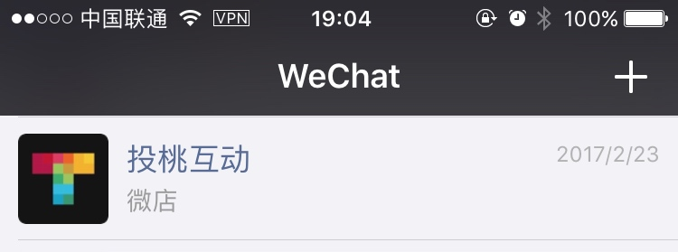

# 微信企业号

## 一、企业号的介绍

为企业或组织提供移动应用入口，帮助企业建立与员工、上下游供应链及企业应用间的连接。

> 时至微信企业号的开启，标志着“微信连接一切”实质性的实现了，订阅号连接了人与人，服务于商业，企业号则打破了企业信息传递在时间和空间上的割裂性，企业号将我们完全带入了一个办公移动化的时代，各种会议、交流、分享、讨论随时随地基本上在巴掌大的屏幕上就可以搞定。而这种办公方式的普及必将会改变我们的工作习性。当然，企业号虽然看起来很酷炫，但是移动办公虽轻松，当各种消息压力逼来之时也极易分散注意力，那么如何在正常的工作情况下不受干扰和通过企业号提高工作效率。

## 二、适用对象

企业、政府、事业单位或其他有需求的组织

## 三、显示位置

直接显示在微信对话列表中

## 三、功能

帐号完成企业认证后可以将所有企业员工微信导入

1. 微信打卡
2. 微信报销
3. 微信会议等企业功能都可以在微信上完成。

一个企业号可配置多个类似服务号的应用，发送信息条数无限制。

