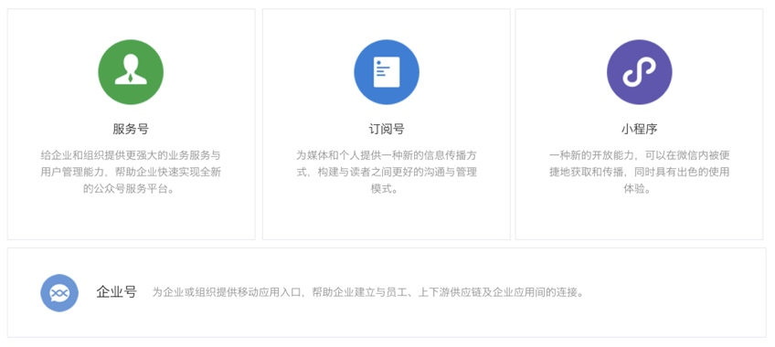
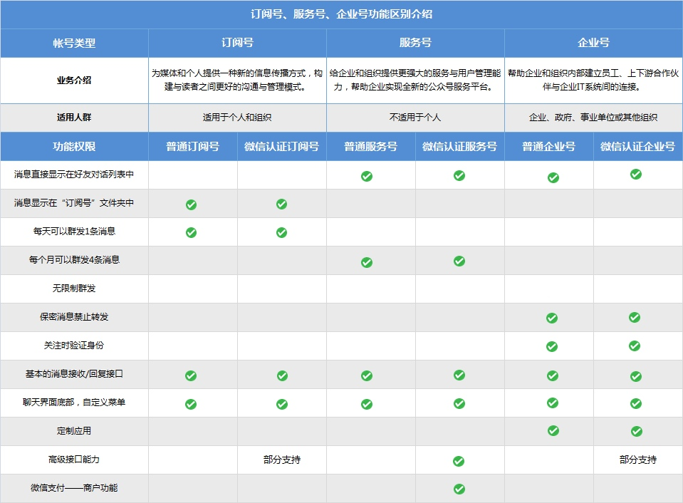
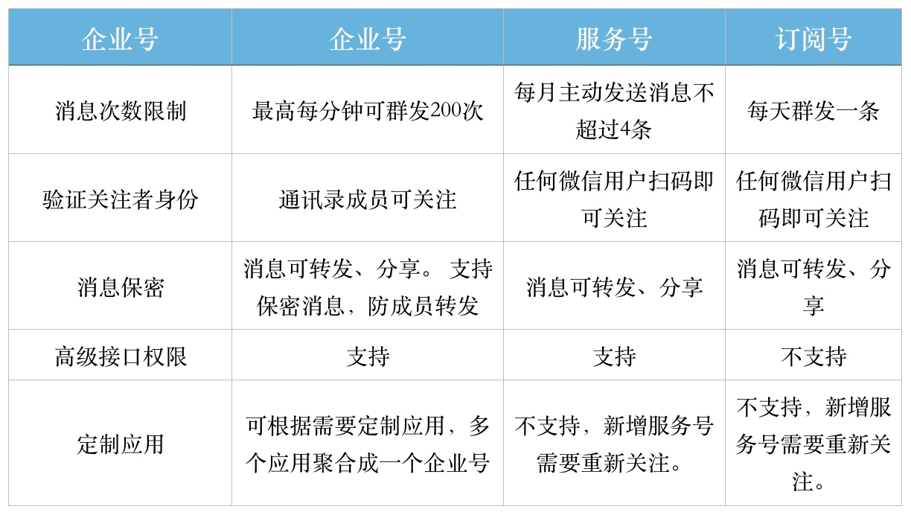
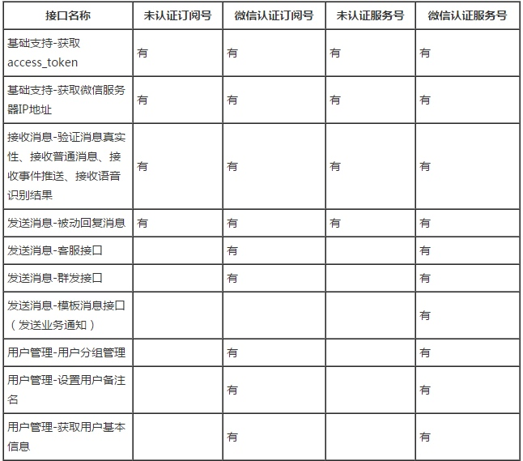
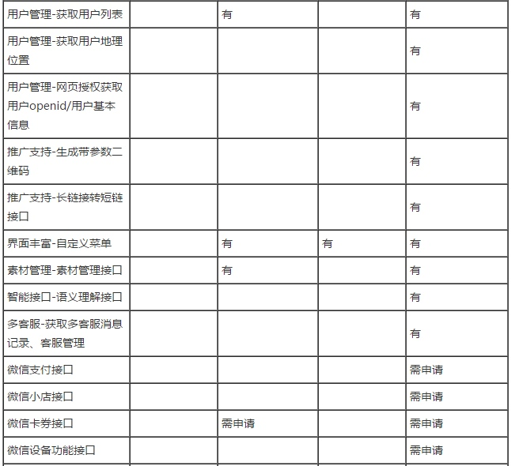
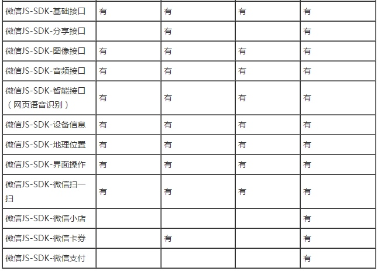
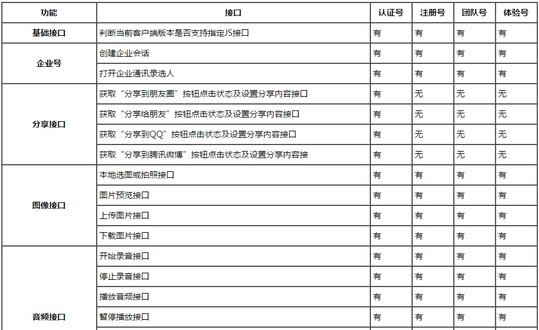
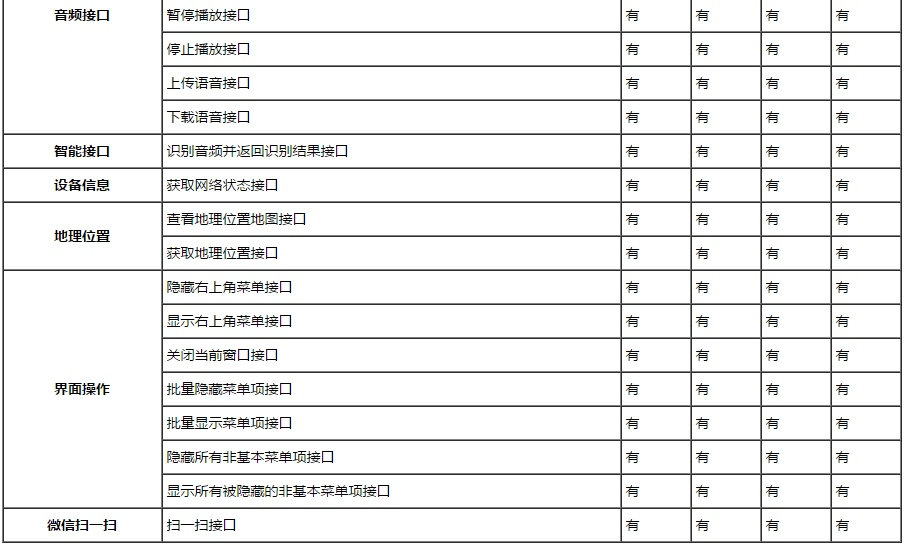

# 微信公众平台简介

## 1. 什么是微信公众平台
微信公众平台，简称公众号。曾命名为“官号平台”、“媒体平台”、微信公众号，最终定位为“公众平台”，无疑让我们看到一个微信对后续更大的期望。和新浪微博早期从明星战略着手不同，微信此时已经有了亿级的用户，挖掘自己用户的价值，为这个新的平台增加更优质的内容，创造更好的粘性，形成一个不一样的生态循环，是平台发展初期更重要的方向。利用公众账号平台进行自媒体活动，简单来说就是进行一对多的媒体性行为活动，如商家通过申请公众微信服务号通过二次开发展示商家微官网、微会员、微推送、微支付、微活动、微报名、微分享、微名片等，已经形成了一种主流的线上线下微信互动营销方式

## 2. 公众号的账号类型

## 3. 订阅号、服务号、企业号功能区别

上面提到了“高级接口权限”，微信的9大高级接口是指如下接口：

1. 语音识别接口
2. 客服接口
3. OAuth2.0 网页授权接口
4. 生成带参数的二维码接口
5. 获取用户地理位置接口
6. 获取用户基本信息接口
7. 获取关注者列表接口
8. 用户分组接口
9. 上传下载多媒体文件接口

### 4. 微信服务号与和订阅号是否认证接口权限是有区别的：

### 5. 企业号帐号角色分为体验号、团队号、注册号和认证号，其中体验号、团队号与注册号的权限一致，认证号则拥有更多的JS-SDK权限，具体详见下方表格：

**总结起来订阅号就是多数用于别人主动来找信息，服务号是积极推送信息，企业号是品牌信任问题。**

