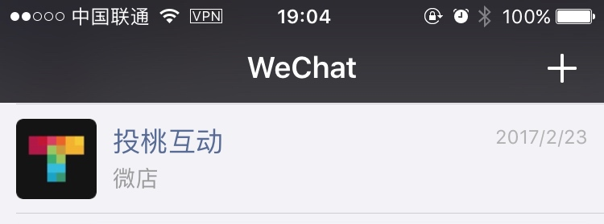

# 微信服务号

## 一、服务号的介绍

给企业和组织提供更强大的业务服务与用户管理能力，帮助企业快速实现全新的公众号服务平台。

> 相比于订阅号，服务号要复杂的多，当微信有了朋友圈可以卖商品，订阅号可以做营销。那么当出现人与商业之间的联系需求时，服务号便诞生了，它不仅要要做一个服务者还要做一个领导者。因为一旦涉及到商业，必然会出现利益的交换，那么如何平衡电商和社交则需要一步步去探索，于是也成就了一大批如O点O商惠通云平台、微盟、口袋通等基于微信第三方开发的公司，同时也快速增长了微信公众号的注册，7月底官方公布是580万，目前还在稳定增长中，也真正迎来了移动互联网时代，但是怎么去利用这个资源赚钱，也成了服务号的困惑。

## 二、适用对象

媒体、企业、政府或其他组织。**~~不能为个人~~**

## 三、显示位置

直接显示在微信对话列表中

## 三、功能

1. 群发消息
2. 微信认证
3. 高级接口
4. 广告主
5. 流量主
6. 多客服
7. 自定义菜单
8. 微信支付
9. 微信小店

